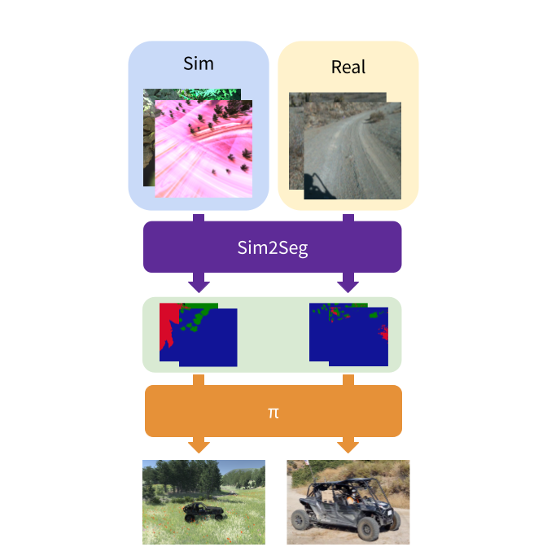

# Sim2Seg: End-to-end Off-road Autonomous Driving without Real Data

Official Pytorch implementation of [Sim2Seg](https://arxiv.org/abs/2210.14721) ([paper](https://arxiv.org/abs/2210.14721), [site](https://sites.google.com/view/sim2segcorl2022/home)) by

[John So\*](https://www.johnrso.xyz/), [Amber Xie\*](https://amberxie88.github.io/), [Sunggoo Jung](https://www.linkedin.com/in/sunggoo-jung-82755b94/), [Jeffrey Edlund](https://www-robotics.jpl.nasa.gov/who-we-are/people/jeffrey_edlund/), [Rohan Thakker](https://www-robotics.jpl.nasa.gov/who-we-are/people/rohan_thakker/), [Ali-akbar Agha-mohammadi](https://www-robotics.jpl.nasa.gov/who-we-are/people/ali_agha/), [Pieter Abbeel](https://people.eecs.berkeley.edu/~pabbeel/), and [Stephen James](https://stepjam.github.io/).


\*equal contribution

<p align="center">
  
 </p>

## Installation

Install the following libraries:
```sh
sudo apt update
sudo apt install libosmesa6-dev libgl1-mesa-glx libglfw3
```

Install dependencies:
```sh
conda env create -f conda_env.yml
conda activate sim2seg
```

We release a sample Unity driving environment. We use the [Free Stylized Nature Environment](https://assetstore.unity.com/packages/3d/environments/free-stylized-nature-environment-96371) and the free [Realistic Buggy Kit](https://assetstore.unity.com/packages/tools/physics/realistic-buggy-kit-62978). To try running Sim2Seg on this basic environment, download the files from [this link](https://drive.google.com/drive/folders/1jsAb-9eL6vDkauUiKYazaW0utZ43INX1?usp=sharing).

In our paper, we use a set of diverse and more realistic environments. You can purchase them on the Unity Asset store: 
- [Meadow: Dyamic Nature Meadow Environment](https://assetstore.unity.com/packages/3d/vegetation/meadow-environment-dynamic-nature-132195)
- [Landscapes: Real Landscapes Valley Forest](https://assetstore.unity.com/packages/3d/environments/real-landscapes-valley-forest-194338)
- [Canyon: Castle Valley Collection 1](https://assetstore.unity.com/packages/3d/environments/castle-valley-collection-1-hdrp-165031)

To download a Sim2Seg segmentation model for training in the segmentation space, visit [this link](https://drive.google.com/drive/folders/1jsAb-9eL6vDkauUiKYazaW0utZ43INX1?usp=sharing).

To run headlessly, follow instructions at [RLBench](https://github.com/stepjam/RLBench).

## Instructions

Train the agent:
```sh
python3 train.py experiment_folder=first_folder experiment_name=first_experiment
```

To train on multiple environments set `use_switch_every=True` and set `eval_task_names` and `train_task_names` to the train and evaluation environments. Note that we switch the Sim2Seg segmentation model per each environment to avoid distribution shifts between environments. For our real-world deployment, we use a separate Sim2Seg segmentation model trained on all environments. We currently only provide a sample Sim2Seg model, so all models are the same.

To train without Sim2Seg, set `use_s2s=False`. 

To train headlessly, refer [here](https://github.com/stepjam/RLBench#running-headless) for headless rendering w/ VirtualGL!

## Citations
If you use this code for your research, please cite our paper:
```sh
@inproceedings{
so2022simtoreal,
title={Sim-to-Real via Sim-to-Seg: End-to-end Off-road Autonomous Driving Without Real Data},
author={John So and Amber Xie and Jeffrey Edlund and Rohan Thakker and Sunggoo Jung and Ali-akbar Agha-mohammadi and Pieter Abbeel and Stephen James},
booktitle={6th Annual Conference on Robot Learning},
year={2022},
url={https://openreview.net/forum?id=eyxfGTFZbNQ}
}
```

## Cited Repositories

We build off of the following repositories / papers:
- [DrQv2](https://github.com/facebookresearch/drqv2)
- [pix2pix](https://github.com/junyanz/pytorch-CycleGAN-and-pix2pix)

## License
Sim2Seg is licensed under the MIT license. 
